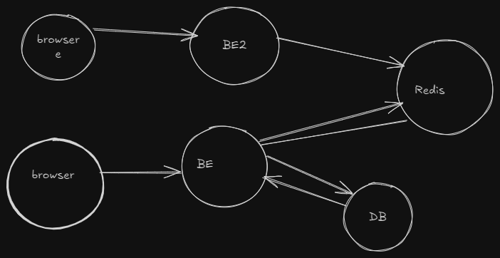
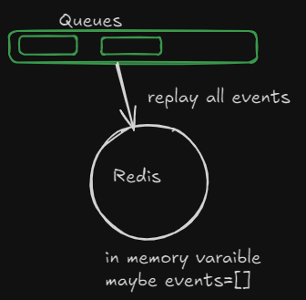
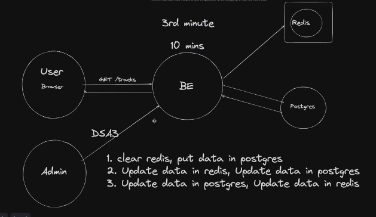

### Redis Provides in memory storage 
- Used for caching 

Meaning one a request is hit to db , the response gets cached in redis(in memory database) and hence upcoming reuqest if same can be served from redis instead of hitting db 

This makes application very fast 
Also supports distributed caching

## What if server goes down ? Cache is lost 
When a server goes down, the in-memory cache is lost. However, this does not affect the application because a new request can be made to the database, and Redis will update the cache with fresh data. Hence, the application performance is not impacted by the cache loss.

## What if redis goes down? All cached data gets lost 
When Redis goes down, all cached data is lost. But how can we recover the state of Redis and minimize performance disruption?

#### Use queues Solution1

- Maintain all the events in a queue , if inmemory storage(redis goes down) just replay al the events and recover the state of redis (in memory cache)
- But the queue might get too long , billions events and hence takes a lot of time 

#### Use snapshot Solution2 
- Another approach is to snapshot the in-memory data at regular intervals, e.g., every hour or day. If Redis goes down, we can restore the latest snapshot and then replay the events from the queue to recover any data that was cached after the snapshot.
- Advantage: This reduces the number of events that need to be replayed since only those after the snapshot need to be processed.

### What is database gets updated ?
Let's say Redis caches the data after a request is made to the database, and snapshots are taken every 10 minutes. If Redis goes down, the cache can be restored by loading the latest snapshot and replaying events from the queue.

Problem Scenario:
- If the database is updated (e.g., by an admin) 3 minutes after the snapshot, how do we ensure that Redis serves the updated data to the user?

Best Practice:
- In this case, it's important to clear Redis cache and cache the updated data from the database. Here’s how you can handle this:

When a critical update is made to the database, automatically invalidate or clear the related cache in Redis.
Upon the next request, Redis will re-cache the fresh data from the database.

Best apporach would be Cleaer Redis , put data in postgres

