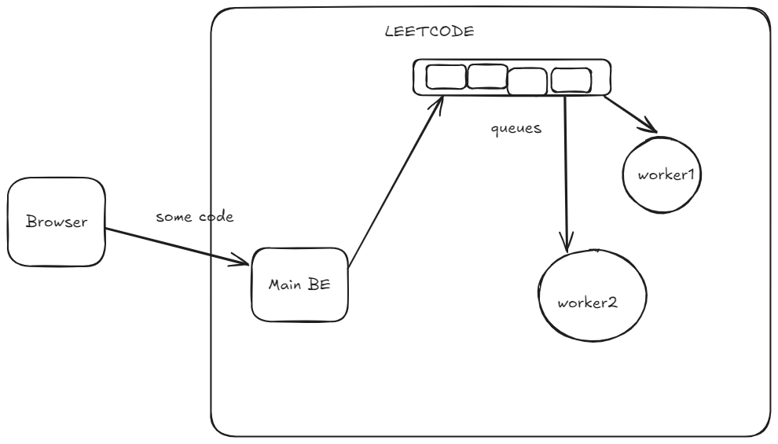
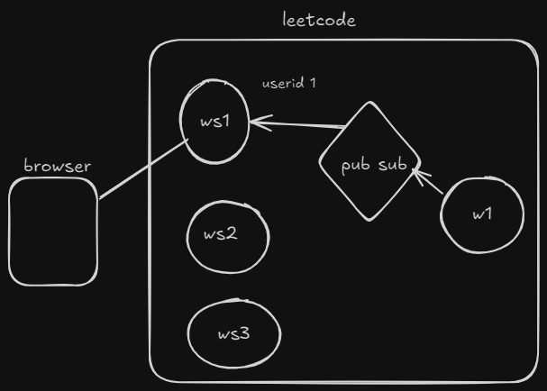
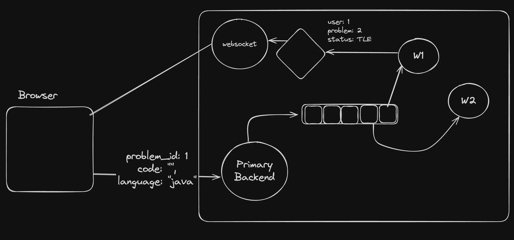
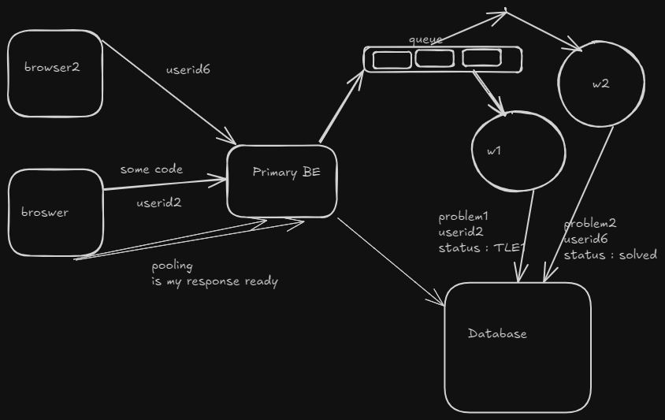

Websockets ===> user to be communications

pub sub queues ==> two backend 

# Leetcode 
Browser send code to Primary BE which is then sent to queue .
Turn by turn worker picks form queue and prepares result 

Why queues ? Primary BE can simply solve the problem and reply 
1 What is primary BE face infinite loop code ? or some bad code 
It doesnot matter even if the worker go down . (there must be some time limit execeed for worker as well )

# Pub Sub
How does the backend respond to user ? 
Via pubsub . 

The worker publishes the response to the pubsub with (maybe some userId)  
Pubsub then looks for all the websocket connection subcribed to it with same userid and sends the response 
And hence the browser gets response from respective websocker server 

Final Architecture 

## Overview of actual leetcode architecture 
Using polling 
